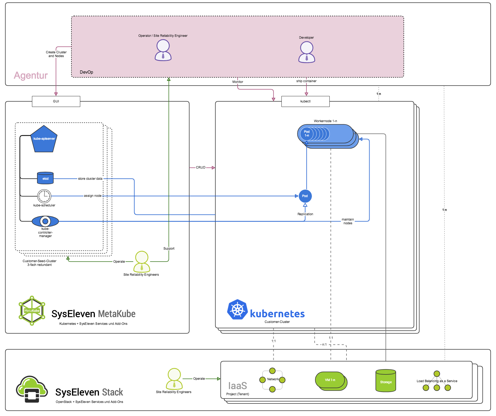

[SysEleven MetaKube](https://metakube.syseleven.de) is the managed [Kubernetes](https://kubernetes.io/) service from [SysEleven](https://www.syseleven.de) - a Berlin based managed hosting company.

MetaKube is a [Certified Hosted Kubernetes Platform](https://landscape.cncf.io/landscape=certified-kubernetes-hosted&selected=sys-eleven-meta-kube),
which ensures that the Kubernetes clusters are fully standard compliant. The conformance test results are publicly available for Kubernetes [1.10](https://github.com/cncf/k8s-conformance/tree/master/v1.10/metakube) and [1.11](https://github.com/cncf/k8s-conformance/tree/master/v1.11/metakube)

## Architectural Overview

The following chart will give you a rough overview of what it means to have Kubernetes managed by us. You will not have to struggle setting up the cluster yourself or thinking about security and scalability of the master components - we already did that for you. Just spin up your cluster in our web interface and enjoy high performance Kubernetes clusters on the [SysEleven Stack](https://www.syseleven.de/syseleven-stack/).

