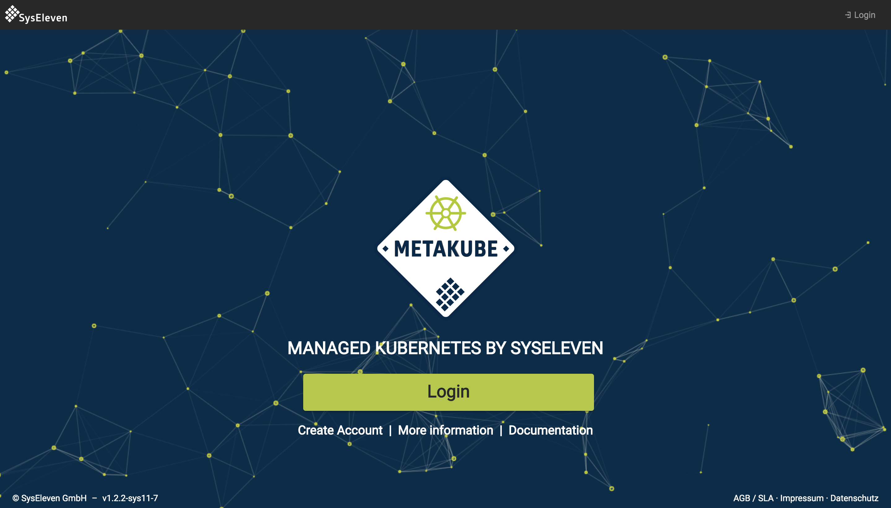

To gain access to SysEleven MetaKube you need to register for [SysEleven Stack](https://www.syseleven.de/syseleven-stack/). Once you have access to the SysEleven Stack open a webbrowser and visit [metakube.syseleven.de](https://metakube.syseleven.de/).

You will be greeted with a `Login / Sign-In` button

Click on the button, enter your SysEleven Stack credentials and start using SysEleven MetaKube, e.g. by [creating your first cluster](/tutorials/create-a-cluster).
