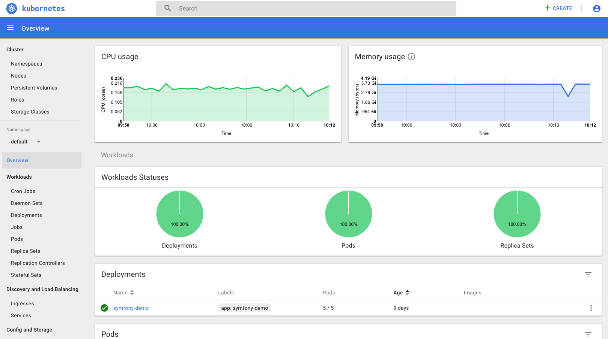

For convenience we install the [Kubernetes Dashboard](https://kubernetes.io/docs/tasks/access-application-cluster/web-ui-dashboard/) into every cluster, though for security reasons it is not exposed publicly. In order to access it, [install kubectl](/tutorials/using-kubectl) and run:

```bash
kubectl proxy
```

Then open the following link in your browser
[http://localhost:8001/api/v1/namespaces/kube-system/services/https:kubernetes-dashboard:/proxy/](http://localhost:8001/api/v1/namespaces/kube-system/services/https:kubernetes-dashboard:/proxy/)

Use the [downloaded kubeconfig](/tutorials/download-kubeconfig) to log in


You should now see the dashboard


