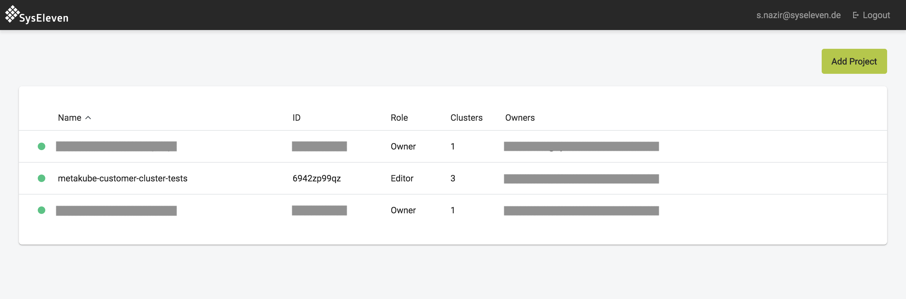
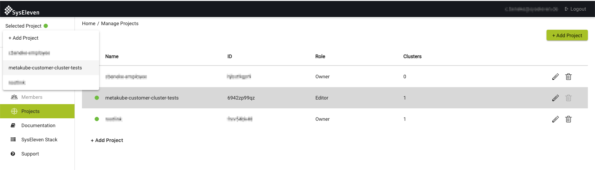

With projects you can group your MetaKube clusters and SSH keys and allow other MetaKube users to also use or maintain your cluster, by inviting them as a member to the project.

## Switching the current project

You can see and switch the currently active project with the drop-down menu in the upper left corner:

## Adding a new project

In the list of all your projects you can create new projects or delete existing ones. Additionally you can find an `Add Project` button in the drop-down menu in the upper left corner.

## Adding members to a project

In the members list of a project you can add or remove additional members to your project. You can only add members with a SysEleven Stack account, that have logged into the MetaKube interface at least once (see [Registration and Login](../01.registration-and-login/default.en.md)) . All members can [download a kubeconfig](../../03.Tutorials/06.download-the-kubeconfig/default.en.md) with full admin rights to interact with the Kubernetes cluster itself. The following permission roles are available:

### Owner

The creator and owner of a project has full admin access to all clusters and can add and remove members.

### Editor

An editor has full admin access to all clusters, but can not add or remove members.

### Viewer

A viewer can see clusters, but neither add new ones nor edit or delete existing clusters. All services to interact with the cluster, e.g. the webterminal or kubeconfig download, are disabled for a viewer. Please note: changing the role of a member from editor to viewer does not invalidate the kubeconfig. If the person already downloaded the config the access will not be revoked automatically.
