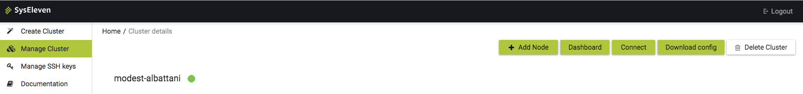
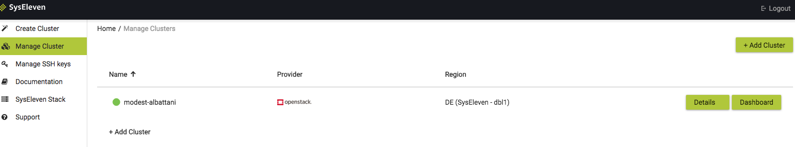

Every MetaKube cluster comes with a dashboard directly in the MetaKube web interface that shows the current state of a Kubernetes cluster, for example how many pods are running or how the cluster is used.
To access the dashboard just click on the `Dashboard` link on the cluster detail page or in the cluster list:

