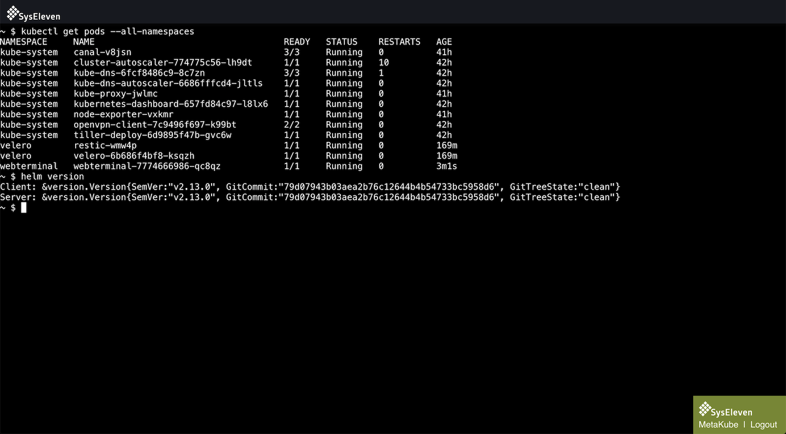

Every MetaKube cluster comes with a web-terminal directly in the MetaKube web interface that gives command line access to the cluster directly from the browser.
To access the web-terminal just click on the `Web Terminal` link on the cluster detail page:

This bash terminal runs on Alpine Linux in the background and comes installed with all the necessary tools to interact with your cluster:

1) [kubectl](https://kubernetes.io/docs/tasks/tools/install-kubectl/)
2) [helm](https://helm.sh/)
3) [tiller](https://docs.helm.sh/install/#installing-tiller)
4) [Ark](https://github.com/heptio/ark)
5) curl, wget and git

