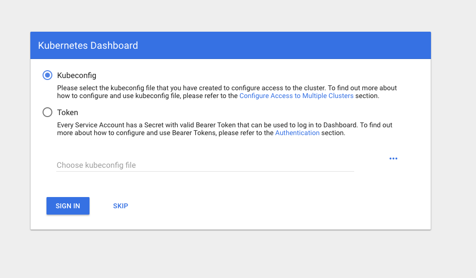
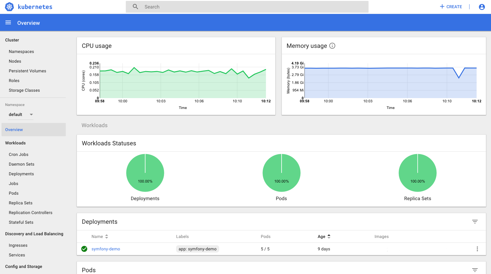

For convenience we install the [Kubernetes Dashboard](https://kubernetes.io/docs/tasks/access-application-cluster/web-ui-dashboard/) into every cluster, though for security reasons it is not exposed publicly. In order to access it, [install kubectl](../../03.Tutorials/07.using-kubectl/default.en.md) and run:

```bash
kubectl proxy
```

Then open the following link in your browser [http://localhost:8001/api/v1/namespaces/kube-system/services/https:kubernetes-dashboard:/proxy/](http://localhost:8001/api/v1/namespaces/kube-system/services/https:kubernetes-dashboard:/proxy/) and use the [downloaded kubeconfig](../../03.Tutorials/06.download-the-kubeconfig/default.en.md) to log in:



You should now see the dashboard:


