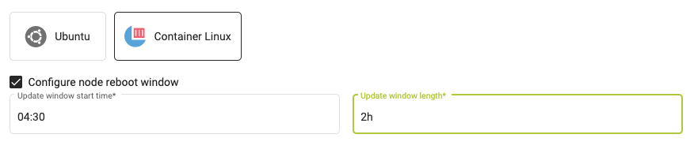
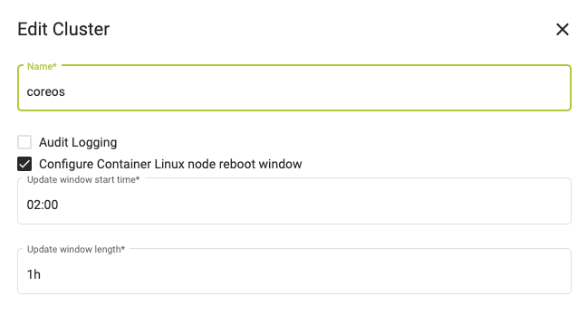

The default operating system for MetaKube clusters is **Ubuntu**. You can also create clusters with **CoreOS Container Linux**. We provide images for the latest tested release of all operating systems.

You can also [upload and use your own images](../../04.tutorials/12.how-to-use-custom-images-for-your-worker-nodes/default.en.md), though you need to ensure that you are using an image with a supported version of the correct operating systems (see below).

For more information on supported images and how to upload your own see the [SysEleven Stack documentation](https://docs.syseleven.de/syseleven-stack/en/reference/images).

## Supported Operating Systems and Versions

| Name and Version | SSH username |
| ---------------- | ------------ |
| Ubuntu Bionic 18.04 | ubuntu |
| CoreOS stable | core |

## Timezone

The timezone on all provided images is UTC. If you want to set a different timezone you have to use your own image, though using UTC is generally recommended to not run into problems with daylight saving times.

## CoreOS

On CoreOS Container Linux updates are applied automatically (though this can be disabled when creating a NodeDeployment). For more information see [CoreOS Update Philosophy](https://coreos.com/why/#updates).

If an update requires a reboot of the node, MetaKube will drain the node and reboot it after all Pods have been rescheduled. It is also ensured that only one node is rebooted at a time. By default this can happen at any point in time. Optionally you can configure a time window where these reboots occur.

This is possible either in the "Settings" step of the cluster creation wizard

or for an existing cluster, in the "Edit cluster" dialog.

