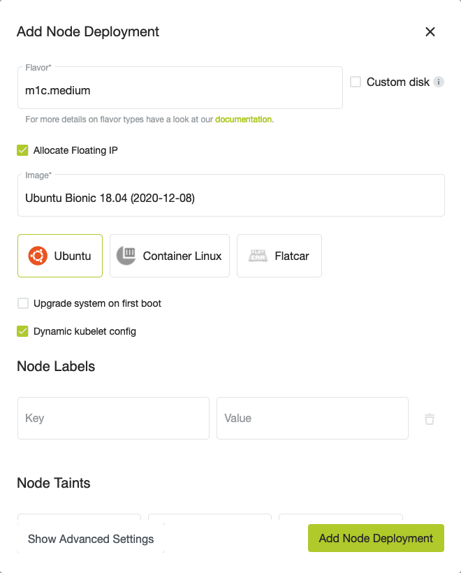

## Dynamic kubelet config

It is possible to dynamically change the kubelet settings for a node deployment in metakube.
This feature can be used to change the kubelet settings on already running nodes.

### Enabling the dynamic kubelet config option

The option can be toggled while creating a new node deployment or when editing an existing one.



### Customizing the kubelet config

! misconfiguring the kubelet config can possibly prevent the kubelet from starting up.

When this option is enabled, multiple configmaps for all supported kubernetes versions will be created in the `kube-system` namespace with names like `kubelet-config-1.17`.

All nodes for the node-deployment are watching for changes in the configmap with the same kubernetes version that is running on the node.
Please keep this in mind because nodes will be using a different configmap after upgrading to a newer kubernetes minor version (e.g. 1.17 -> 1.18).

Once a change is noticed `systemd` will restart the kubelet so that it can use the new configuration.

This is an example configmap to configure the kubelet. It shows how we are configuring the kubelet for kubernetes 1.17 clusters:

```yaml
apiVersion: v1
kind: ConfigMap
metadata:
  labels:
    kubermatic-addon: kubelet-configmap
  name: kubelet-config-1.17
  namespace: kube-system
data:
  kubelet: |
    address: 0.0.0.0
    apiVersion: kubelet.config.k8s.io/v1beta1
    authentication:
      anonymous:
        enabled: false
      webhook:
        cacheTTL: 2m0s
        enabled: true
      x509:
        clientCAFile: /etc/kubernetes/pki/ca.crt
    authorization:
      mode: Webhook
      webhook:
        cacheAuthorizedTTL: 5m0s
        cacheUnauthorizedTTL: 30s
    cgroupDriver: systemd
    cgroupsPerQOS: true
    clusterDNS:
    - 169.254.20.10
    clusterDomain: cluster.local
    configMapAndSecretChangeDetectionStrategy: Watch
    containerLogMaxFiles: 5
    containerLogMaxSize: 10Mi
    contentType: application/vnd.kubernetes.protobuf
    cpuCFSQuota: true
    cpuCFSQuotaPeriod: 100ms
    cpuManagerPolicy: none
    cpuManagerReconcilePeriod: 10s
    enableControllerAttachDetach: true
    enableDebuggingHandlers: true
    enforceNodeAllocatable:
    - pods
    eventBurst: 10
    eventRecordQPS: 5
    evictionHard:
      imagefs.available: 15%
      memory.available: 100Mi
      nodefs.available: 10%
      nodefs.inodesFree: 5%
    evictionPressureTransitionPeriod: 5m0s
    failSwapOn: true
    fileCheckFrequency: 20s
    hairpinMode: promiscuous-bridge
    healthzBindAddress: 127.0.0.1
    healthzPort: 10248
    httpCheckFrequency: 20s
    imageGCHighThresholdPercent: 85
    imageGCLowThresholdPercent: 80
    imageMinimumGCAge: 2m0s
    iptablesDropBit: 15
    iptablesMasqueradeBit: 14
    kind: KubeletConfiguration
    kubeAPIBurst: 10
    kubeAPIQPS: 5
    makeIPTablesUtilChains: true
    maxOpenFiles: 1000000
    maxPods: 110
    nodeLeaseDurationSeconds: 40
    nodeStatusReportFrequency: 1m0s
    nodeStatusUpdateFrequency: 10s
    oomScoreAdj: -999
    podPidsLimit: -1
    port: 10250
    registryBurst: 10
    registryPullQPS: 5
    resolvConf: /etc/resolv.conf
    rotateCertificates: true
    runtimeRequestTimeout: 2m0s
    serializeImagePulls: true
    staticPodPath: /etc/kubernetes/manifests
    streamingConnectionIdleTimeout: 4h0m0s
    syncFrequency: 1m0s
    volumeStatsAggPeriod: 1m0s
```

All customizable kubelet configuration can be found in the [Kubernetes Docs](https://godoc.org/k8s.io/kubelet/config/v1beta1#KubeletConfiguration).
The config keys that are being used in the kubelet configuration are the names after the `json:` prefix.

To get a more in depth look into how the kubelet gets reconfigured you can look at [this kubernetes guide](https://kubernetes.io/docs/tasks/administer-cluster/reconfigure-kubelet/).
