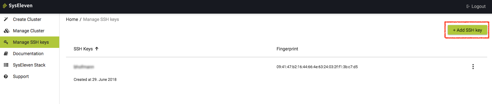

MetaKube needs your SSH public key to create Kubernetes clusters, so that you also can SSH into the created VMs if needed. To add an SSH key navigate to `Manage SSH Keys` in the Dashboard and click on `Add SSH Key`

 This will create a pop up. Enter a unique name and paste the complete content of the SSH key into the respective field

test