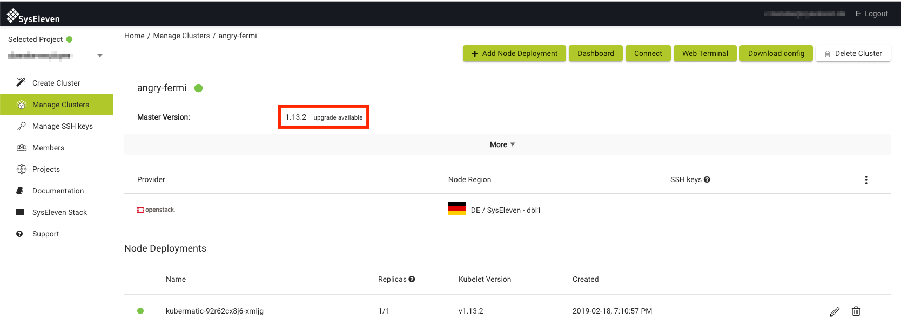
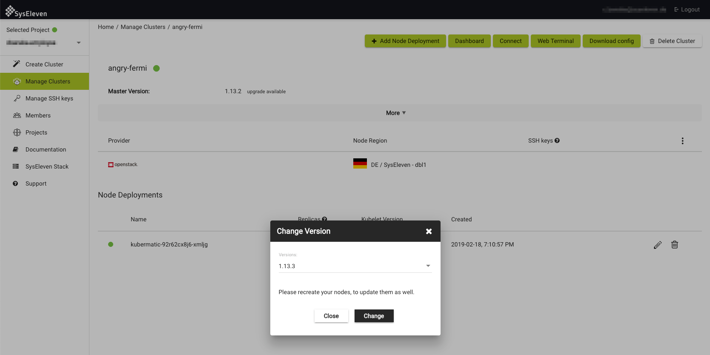
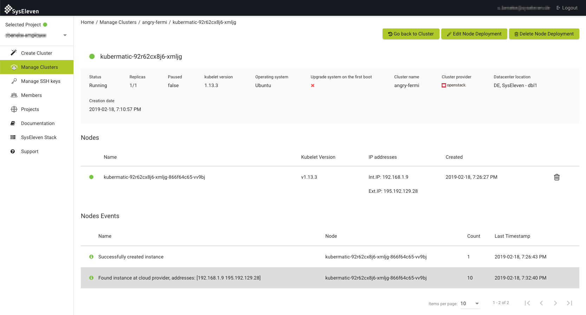

## Upgrade master components

When an upgrade for the master nodes is available, a blue text `upgrade available` will be shown besides the Master version:

To start the upgrade, just click on the link and choose the desired version (most recent, tested version is selected):

After the update is initiated, the master components will be upgraded in the background. All newly created worker nodes will be installed with the new version, but existing nodes will not be changed. Refer to the next chapter on how to upgrade your existing worker nodes.

## Upgrade worker nodes

When you want to upgrade your worker nodes you can easily edit your node deployment for the active cluster and MetaKube will take care of the updates. To do so, open the node deployment overview and click on the `Edit Node Deployment` button:

This will open a popup where you can choose the to be installed Kubernetes version:

Your worker nodes will now be updated one by one:

## Downgrade a cluster

You can also downgrade a cluster to an earlier version, by clicking on the version number of the cluster on the cluster detail page.
