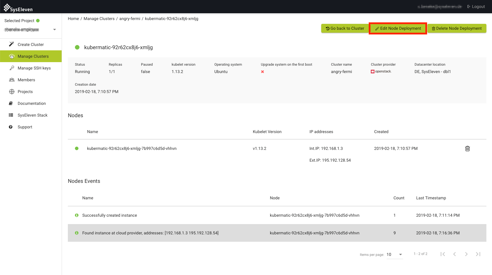
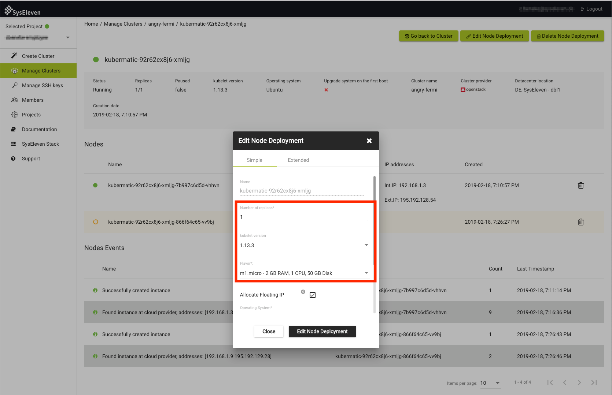
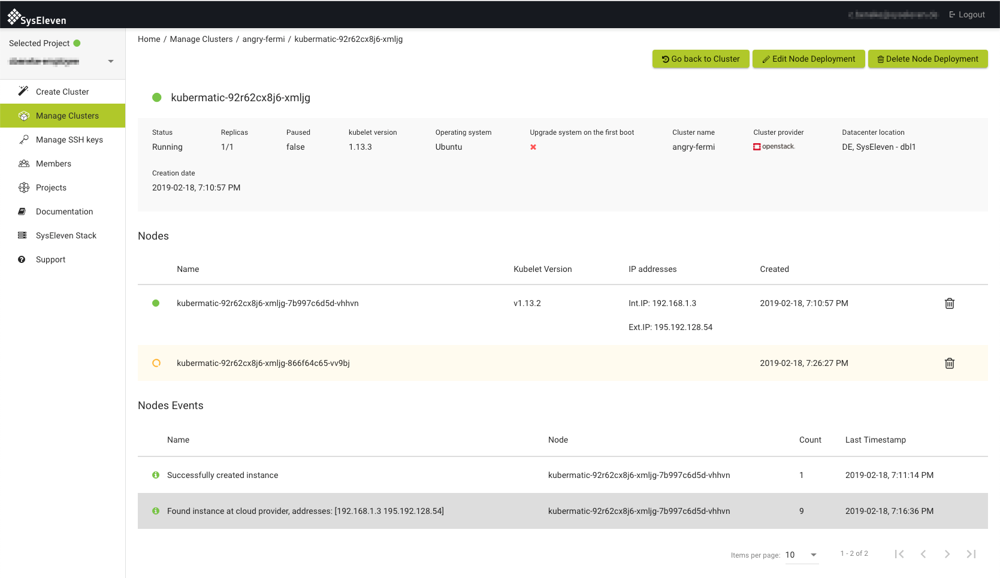

## Add new node deployment

TODO

## Edit the node deployment

To add or delete a worker node you can easily edit the node deployment in your cluster. Navigate to the cluster overview and click on the node deployment you want to change. You will then see the node deployment overview. In this overview click on the `Edit Node Deployment` button:

In the popup you can now in- or decrease the number of worker nodes, which are managed by this node deployment:

Save your changes and wait for MetaKube to add or delete your extra worker node(s):

