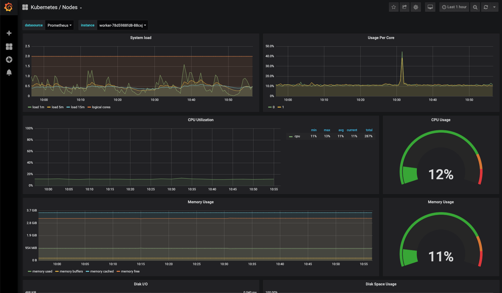

The monitoring Add-On installs a complete monitoring and alerting stack which enables monitoring the cluster as well as all workloads in it.

It automatically comes with sensible, generic dashboards and alerting rules for Kubernetes clusters, and can be easily extended with custom metric sources, dashboards and alerting rules.



## Installed applications

The following applications are installed:

### prometheus-operator

The prometheus-operator orchestrates the management and configuration of the whole monitoring stack. It also provides ways to configure it with Kubernetes resources.

* [Documentation](https://github.com/coreos/prometheus-operator)

### Prometheus

Prometheus is a powerful open-source systems monitoring and alerting toolkit, that integrates nicely with Kubernetes.

* [Documentation](https://prometheus.io/docs/)

### Alertmanager

Alertmanager enables sending out alerts based on Prometheus metrics and queries.

* [Documentation](https://prometheus.io/docs/alerting/alertmanager/)

### kube-state-metrics

kube-state-metrics is a monitoring agent that generates and exposes cluster-level metrics of the Kubernetes cluster to Prometheus.

* [Documentation](https://github.com/kubernetes/kube-state-metrics)

### Grafana

Grafana is a powerful data visualization tool with which you can create rich dashboards from your Prometheus metrics.

## Installation

For information on how to install and uninstall an Add-On see [MetaKube Add-Ons](../default.en.md).

## Customization

The following customization options are possible:

### Prometheus Configuration Options

| Option | Description | Default value |
| ------ | ----------- | ------------- |
| Retention Time | How long should the data in Prometheus be stored | 7d |
| Persistent Storage | How large should the persistent data volume be | 50Gi |
| CPU Requests | How many milli CPUs should be reserved | 750m |
| Memory Requests | How much memory should be reserved | 750Mi |
| CPU Limits | What is the maximum of used milli CPUs | 1000m |
| Memory Limits | What is the maximum of used memory | 1000Mi |

### Grafana Configuration Options

| Option | Description | Default value |
| ------ | ----------- | ------------- |
| CPU Requests | How many milli CPUs should be reserved | 100m |
| Memory Requests | How much memory should be reserved | 100Mi |
| CPU Limits | What is the maximum of used milli CPUs | 200m |
| Memory Limits | What is the maximum of used memory | 200Mi |

### Alertmanager Configuration Options

| Option | Description | Default value |
| ------ | ----------- | ------------- |
| Retention Time | How long should the data in Alertmanager be stored | 120h |
| CPU Requests | How many milli CPUs should be reserved | 100m |
| Memory Requests | How much memory should be reserved | 100Mi |
| CPU Limits | What is the maximum of used milli CPUs | 200m |
| Memory Limits | What is the maximum of used memory | 200Mi |
| Config | Allows to configure where Alertmanager should send alerts | Default Configuration which sends no alerts |

For more information on configuring Alertmanager rules see [Alertmanager Configuration](https://prometheus.io/docs/alerting/configuration/#configuration-file) or the examples below.

## Documentation

### Scraping additional applications with Prometheus

You can configure Prometheus to scrape additional pods and services by adding `PodMonitor` or `ServiceMonitor` resources to the `syseleven-monitoring` namespace.

A `ServiceMonitor` selects a Kubernetes Service and then scrapes all backend pods of this Service. The following definition will every 30 seconds scrape `/metrics` on the metrics port of all pods behind the services that match the label `app: my-application` in the `my-application-namespace` namespace:

```yaml
apiVersion: monitoring.coreos.com/v1
kind: ServiceMonitor
metadata:
  name: my-application
  namespace: syseleven-monitoring
spec:
  endpoints:
    - interval: 30s
      scrapeTimeout: 30s
      port: metrics
      path: /metrics
  namespaceSelector:
    matchNames:
      - my-application-namespace
  selector:
    matchLabels:
      app: my-application
```

A `PodMonitor` scrapes all pods in a namespace matching a certain label. The following definition will every 30 seconds scrape `/metrics` on the metrics port of all pods that match the label `app: my-application` in the `my-application-namespace` namespace:

```yaml
apiVersion: monitoring.coreos.com/v1
kind: PodMonitor
metadata:
  name: my-application
  namespace: syseleven-monitoring
spec:
namespaceSelector:
  podMetricsEndpoints:
    - interval: 30s
      scrapeTimeout: 30s
      port: metrics
      path: /metrics
  matchNames:
    - my-application-namespace
  selector:
    matchLabels:
      app: my-application
```

For additional information on configuring PodMonitors and ServiceMonitors have a look at the [API Documentation](https://github.com/coreos/prometheus-operator/blob/master/Documentation/api.md).

### Adding alerting rules

You can configure additional alerting rules in Prometheus by creating a `PrometheusRule` resource in the `syseleven-monitoring` namespace.

Example:

```yaml
apiVersion: monitoring.coreos.com/v1
kind: PrometheusRule
metadata:
  name: my-alerting-rule
  namespace: syseleven-monitoring
spec:
  groups:
    - name: my-alerts
      rules:
        - alert: MyDeploymentReplicasMismatch
          expr: |
            kube_deployment_spec_replicas{deployment="my-deployment"}
            != kube_deployment_status_replicas_available{deployment="my-deployment"}
          for: 1h
          labels:
            severity: warning
          annotations:
            description: Deployment \{\{\$labels.namespace\}\}/\{\{\$labels.deployment\}\} has not matched the expected number of replicas for longer than an hour.
```

For additional information on configuring PrometheusRules have a look at the [API Documentation](https://github.com/coreos/prometheus-operator/blob/master/Documentation/api.md) as well as the [Prometheus Documentation](https://prometheus.io/docs/prometheus/latest/configuration/alerting_rules/).

### Configuring where Alertmanager should send alerts

You can configure where Alertmanager should send alerts with YAML in the "Config" field when installing or configuring the Add-On. For more information on configuring Alertmanager rules see [Alertmanager Configuration](https://prometheus.io/docs/alerting/configuration/#configuration-file).

For example this config would send every alert to an email address and a slack channel:

```yaml
global:
  resolve_timeout: 5m
  smtp_smarthost: 'smtp.example.org:25'
  smtp_from: 'alertmanager@example.org'
  smtp_auth_username: 'alertmanager'
  smtp_auth_password: 'password'
  slack_api_url: 'https://hooks.slack.com/services/...'
route:
  group_by: ['job']
  group_wait: 30s
  group_interval: 5m
  repeat_interval: 12h
  receiver: 'alert-mails'
  routes:
  - match:
      alertname: Watchdog
    receiver: 'null'
receivers:
- name: 'alert-mails'
  email_configs:
  - to: 'alerts@example.org'
  slack_configs:
  - channel: '#alerts'
```

### Adding Grafana dashboards

To add additional dashboard to Grafana, add a ConfigMap to the `syseleven-monitoring` Namespace that includes the JSON definition of the dashboard and has the label `grafana_dashboard: "1"`:

```yaml
apiVersion: v1
kind: ConfigMap
metadata:
  name: my-dashboard
  labels:
    grafana_dashboard: "1"
  namespace: syseleven-monitoring
data:
  my-dashboard.json: |
    {
       ...
    }
```

After a few second the new dashboard will be added to Grafana automatically. You can also install grafana dashboards through the grafana webinterface. We have now added a volume to the grafana pod. To store dashboards, plugins, users etc.

A good source for ready made dashboards is the [Grafana Dashboard Directory](https://grafana.com/grafana/dashboards).
