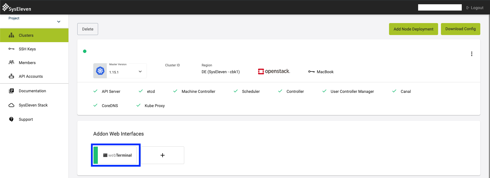

The web-terminal gives you command line access to your cluster and your openstack resources directly from the browser.
To access the web-terminal install the Add-On and click on the `Web Terminal` link on the Add-On web interfaces list:

This bash terminal runs on Alpine Linux in the background and comes installed with all the necessary tools to interact with your cluster and your openstack resources:

1) [kubectl](https://kubernetes.io/docs/tasks/tools/install-kubectl/)
2) [helm](https://helm.sh/)
3) [tiller](https://docs.helm.sh/install/#installing-tiller)
4) [Velero](https://github.com/heptio/velero)
5) [OpenStack CLI Tools](https://docs.syseleven.de/syseleven-stack/en/howtos/openstack-cli)
6) curl, wget and git

## Installation

! Note that after installation everyone with "Editor" permissions has access to the Web Terminal and thus also full admin access to the cluster.

For information on how to install and uninstall an Add-On see [MetaKube Add-Ons](../default.en.md).

## Customization

There are no customization options.
