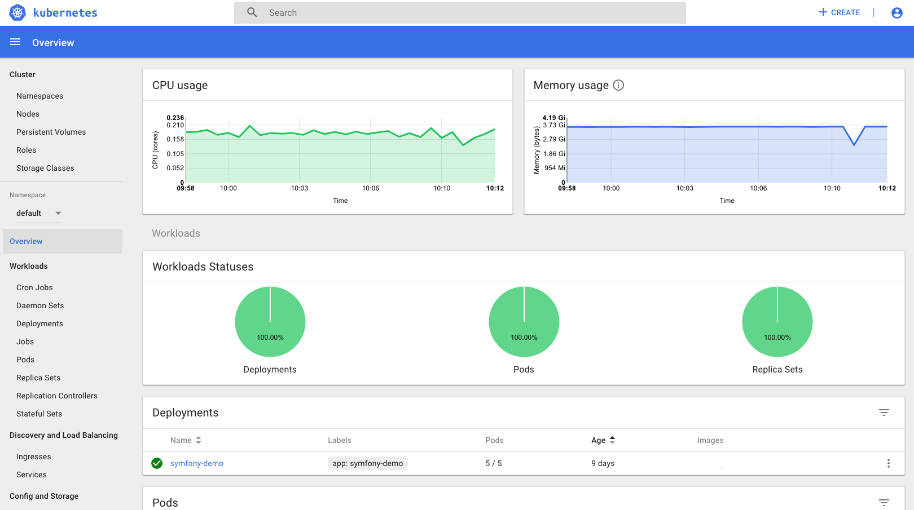

The Kubernetes Dashboard is a general purpose, web-based UI for Kubernetes clusters. It allows users to manage applications running in the cluster and troubleshoot them, as well as manage the cluster itself.

For more information also have a look at the [Kubernetes Documentation](https://kubernetes.io/docs/tasks/access-application-cluster/web-ui-dashboard/).

! Note that currently, when you install it, everyone with "Editor" permissions has access to the Kubernetes Dashboard and thus also full admin access to the cluster.

## Installation

For information on how to install and uninstall an addon see [Addons](../default.en.md).

## Customization

There are no customization options.
