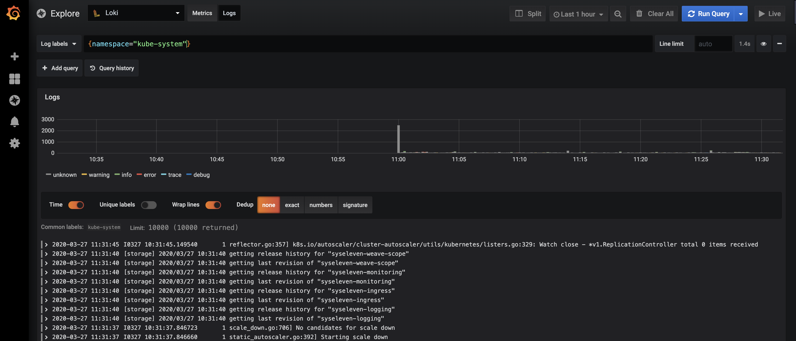

The log management Add-On installs a [Loki](https://github.com/grafana/loki/blob/master/docs/README.md) log management stack that integrates into the Grafana instace from the [Monitoring Add-On](../03.metakube-monitoring/default.en.md).

Because of this the Monitoring Add-On is required to be installed before installing the Log Management Add-On.

All logs provided via stdout or sterr by Pods in the cluster will be collected and stored for the configured retention time.

## Installed applications

### Loki

Loki is the database where all logs are stored.

* [Documentation](https://github.com/grafana/loki/blob/master/docs/README.md)

### Promtail

Promtail runs as a DaemonSet and collects all logs from all nodes and sends them to Loki.

* [Documentation](https://github.com/grafana/loki/tree/master/docs/clients/promtail)

## Installation

For information on how to install and uninstall an Add-On see [MetaKube Add-Ons](../default.en.md).

## Customization

The following customization options are possible:

### Loki configuration options

| Option | Description | Default value |
| ------ | ----------- | ------------- |
| Retention Time | Amount of weeks the logs should be kept | 1 |
| Persistent Storage | How large should the persistent data volume be | 10Gi |
| Reject samples older | Log messages older then this value will never be stored | 168h |
| CPU Requests | How many milli CPUs should be reserved | 500m |
| Memory Requests | How much memory should be reserved | 750Mi |
| CPU Limits | What is the maximum of used milli CPUs | 1000m |
| Memory Limits | What is the maximum of used memory | 750Mi |

### Promtail configuration options

| Option | Description | Default value |
| ------ | ----------- | ------------- |
| CPU Requests | How many milli CPUs should be reserved | 200m |
| Memory Requests | How much memory should be reserved | 128Mi |
| CPU Limits | What is the maximum of used milli CPUs | 500m |
| Memory Limits | What is the maximum of used memory | 128Mi |
