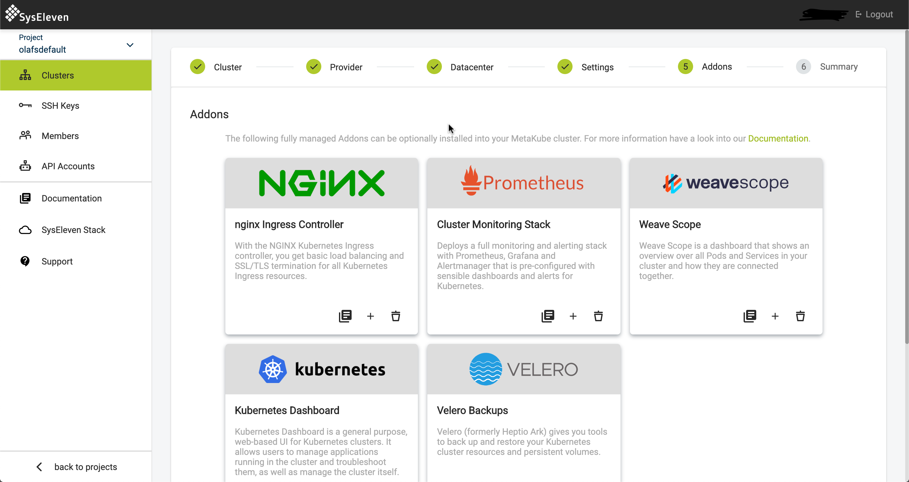
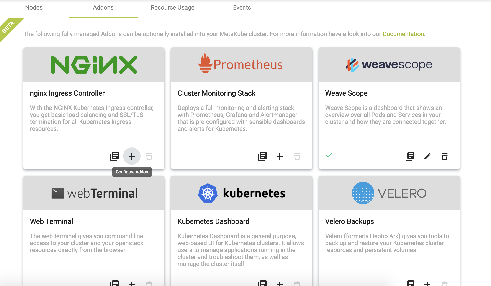
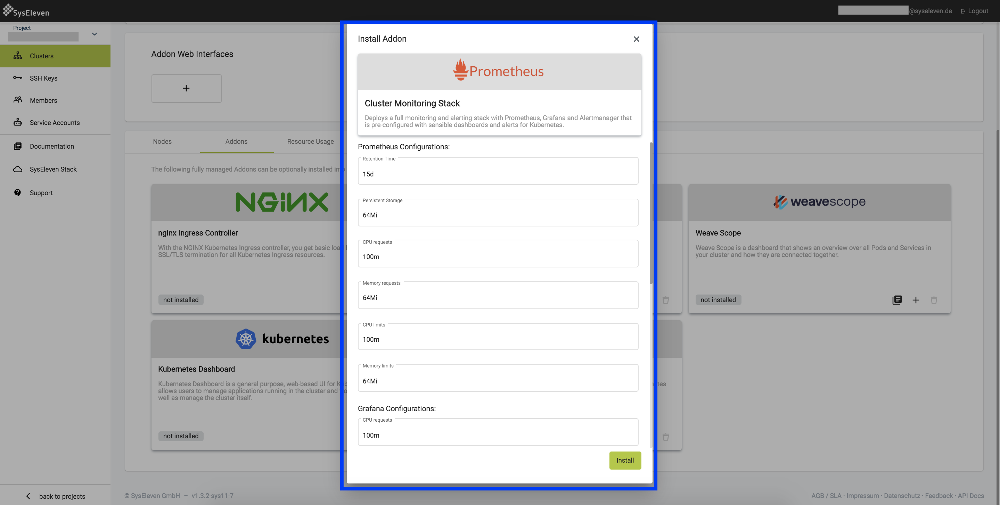
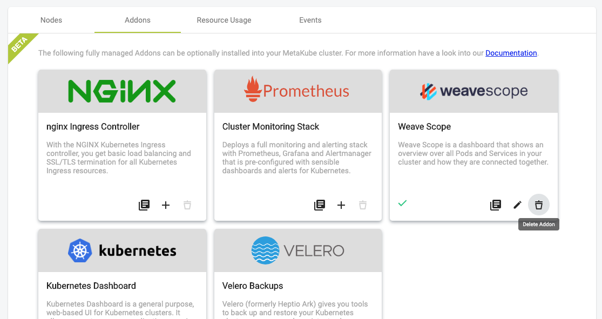
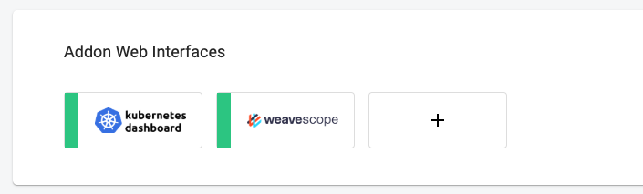

MetaKube Addons are a fully managed services that you can optionally install into your MetaKube cluster.

## Installation of addons

You can install an addon either during cluster creation or later into an already running cluster.

During cluster creation, there is a wizard page that lets you choose the addons to install:

See the [cluster creation tutorial](../04.tutorials/02.create-a-cluster/default.en.md) for more details.

In an already running cluster, select the Addons tab in the cluster overview to get an overview of the available addons:

Both these user interfaces look and work the same. You install an addon by clicking on the '+' button of the addon in the addon tab.

If the addon has any configuration options, you can configure them in the installation dialog.

## Deinstallation of addons

To remove an addon from your cluster, click on the delete icon of the addon and confirm the deletion. Note that all the resources of the addon including all persistent data will be removed.

## Access to the web interfaces of addons

In the "Addon Web Interfaces" list you can access any web interfaces the installed addons provide. Note that the button is only clickable if the web interface is up and running.

## Addon update process

Since the addons are fully managed, version updates will be handled automatically by SysEleven after careful testing.
