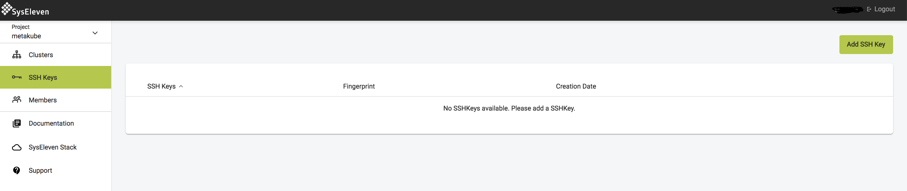
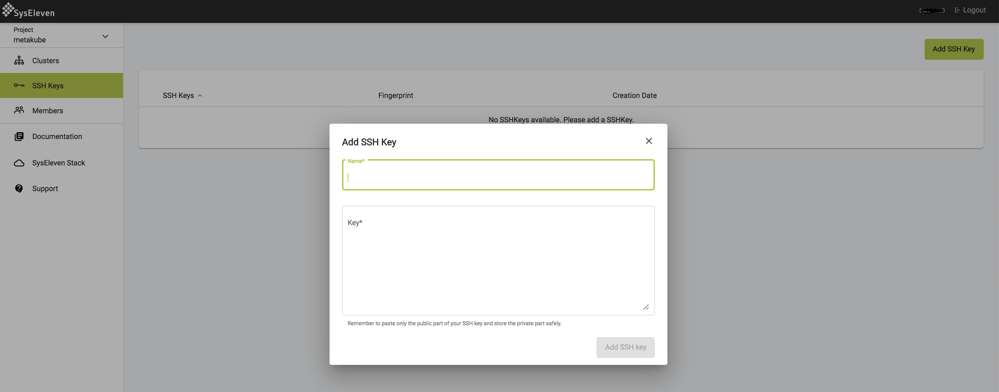
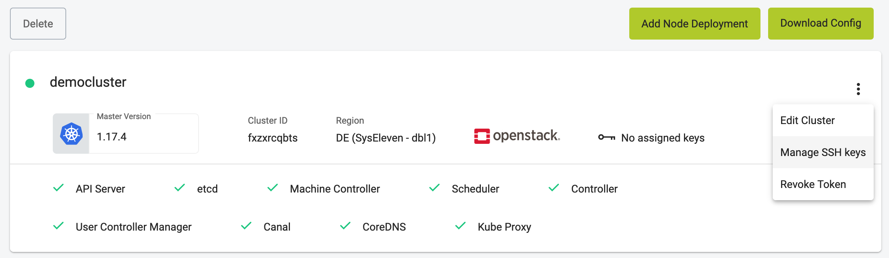
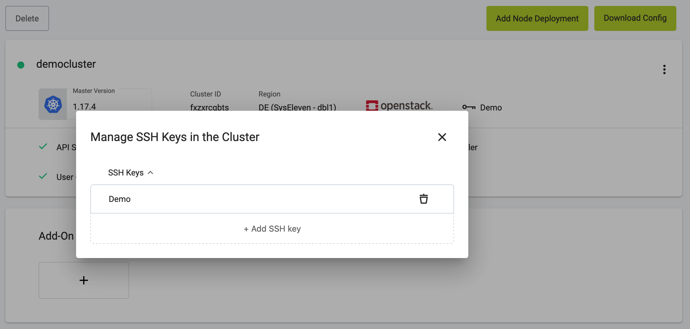

MetaKube needs your SSH public key to create Kubernetes clusters, so that you also can ssh into the created VMs if needed. SSH keys are tied to a [project](../../02.documentation/02.projects/default.en.md).To add an SSH key, navigate to `SSH Keys` in the dashboard and click on `Add SSH Key`:

This will create a pop up. Enter a unique name and paste the complete content of the SSH key into the respective field:

## New clusters

During [cluster creation](../02.create-a-cluster/default.en.md) you can choose which SSH keys should be added to nodes.

## Existing clusters

It is also possible to change the SSH keys of an existing cluster. On the cluster details page open the menu at the top right corner and select `Manage SSH Keys`:

In the popup you can add and remove keys. The changes are then applied to all existing and future nodes of the cluster.

