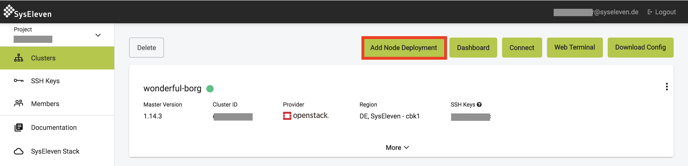
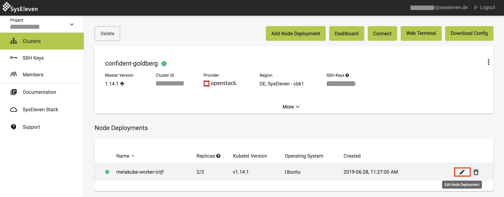
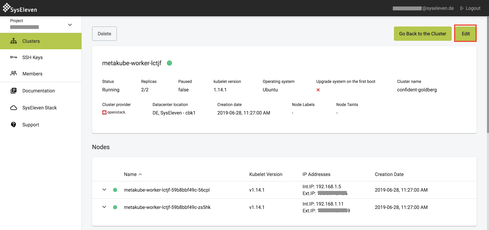
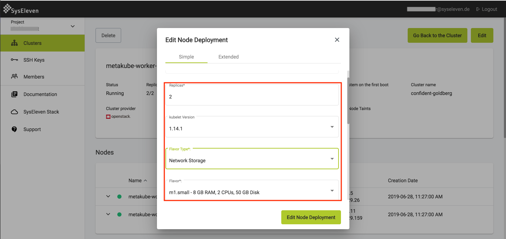
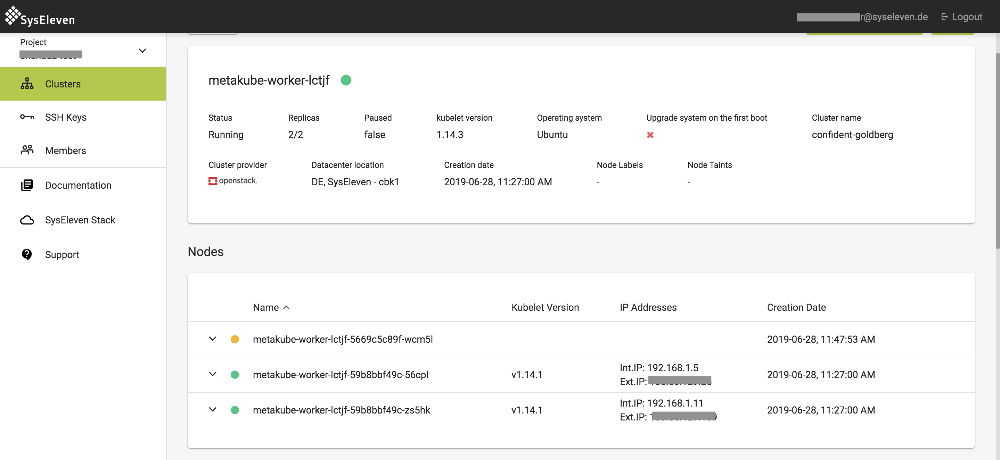

## Add new node deployment

To add a new node deployment navigate to your cluster view and click on the `Add Node Deployment` button:

In the popup you can then choose the number of nodes (replicas), kubelet version, flavor, etc for your newly created nodedeployment. All nodes created in this nodedeployment will have the chosen settings. For a detailed description of the settings have a look at our [cluster-api documentation](../../02.documentation/12.cluster-api/default.en.md).

## Edit the node deployment

To add or delete a worker node you can easily edit your node deployment for the active cluster and MetaKube will take care of the updates. To do so, hover over the node deployment and click the edit button or open the node deployment overview and click on the `Edit` button:

In the popup you can now in- or decrease the number of, as well as the kubelet version, operating system, used image etc of the worker nodes which are managed by this node deployment:

On Openstack, MetaKube will also detect automatically when newer images are available for the node deployment's operating system, and allow you to update with one click.

Save your changes and wait for MetaKube to add or delete your extra worker node(s):

The nodes will be upgraded in a rolling upgrade, which means it does a one-by-one upgrade of all machines. Therefore it will create a new node and when this node is ready will drain and delete an old node and so on until all nodes are updated.
