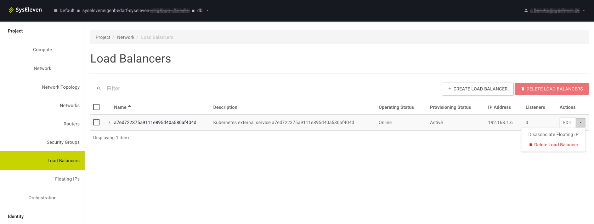
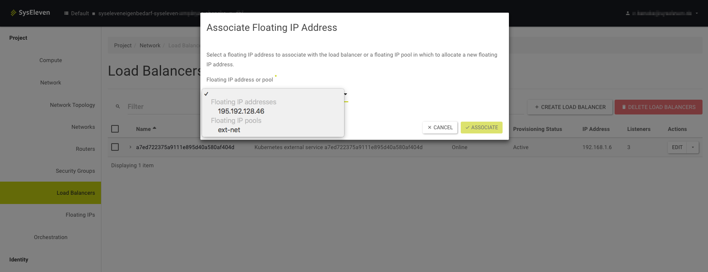

## Change the external IP

If you want to change the external IP of the Load Balancer, you can associate a floating IP to the Load Balancer in the SysEleven Stack dashboard. A newly created Load Balancer already has an IP associated, to disassociate it open the menu `Project -> Network -> Load Balancers` and click on `Disassociate Floating IP`:

Afterwards you can associate another IP by clicking on `Associate Floating IP` in the same menu. This will trigger a popup, where you can either select an already existing floating IP or a floating IP pool:

## Limiting access to a Load Balancer by IP ranges

Every LoadBalancer automatically also receives a SecurityGroup that opens the necessary ports for this Load Balancer up. This SecurityGroup can also be configured to only allow certain source IP ranges by setting the `loadBalancerSourceRanges` field of a service.

For more information see [Configure Your Cloud Provider's Firewalls](https://kubernetes.io/docs/tasks/access-application-cluster/configure-cloud-provider-firewall/).

Note that because of a limitation in Kubernetes, updating or adding this field after the creation of a Load Balancer service is currently not possible.  

## Troubleshooting

### I created a load balancer but can't reach the application

This can have multiple reasons. Typical problems are

* _Your application is not reachable_. Try to use `kubectl port-forward $PODNAME 8080:80` \(port might differ\) and check if you can reach your application on Port 80.
* _The required port is not defined in the service manifest_. Check if the service lists all required ports with `kubectl get svc`.
* _The service port is not reachable._ Check if you can reach the service port on any of your worker nodes. Therefore you need to open the port \(temporarily\) in the cluster security group.
* _The Load Balancer can't reach the worker nodes_. Make sure that your cluster security group has opened the port range `30000 - 32767` for the internal network `192.168.0.0/16`. Usually this is set automatically.
