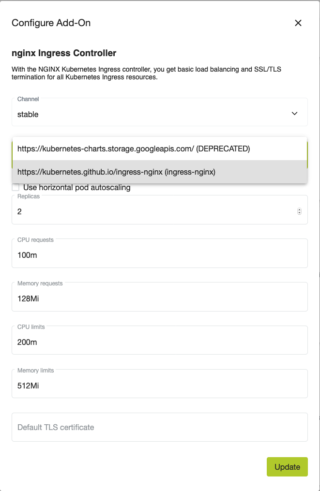

## Why the new `ingress-nginx` helm chart repository?

As of August 2020, in an effort to move out of a central repository for helm charts, the nginx ingress controller developers moved out of the ["stable" central repository](https://github.com/helm/charts/tree/master/stable/nginx-ingress) and deprecated this repository in favor of [`ingress-nginx`](https://github.com/helm/charts/tree/master/stable/nginx-ingress).

The development of the chart will be closer to the development of the ingress controller code, delivering more agility on updates of important features.

## Why do you need manual intervetion?

Manual intervention is needed because changing the helm repository from `stable/nginx-ingress` to `ingress-nginx/ingress-nginx` will override existing components on the helm chart by new ones, especially the load balancer service used by the controller. This will cause the ExternalIP of the load balancer to change, then probably you'll need to change your DNS entries.

We provide an interface to make the required changes easier using our dashboard.

## Step by step process


### Change the Helm Chart Repository on the addon ingress options

Click on the _Add-Ons_ tab of your cluster dashboard. Then click on the _nginx Ingress Controller_ card.
Change the option for _Helm Chart Repository_ to _`https://kubernetes.github.io/ingress-nginx (ingress-nginx)`_ as show in the screenshot below.




### Wait for components to be replaced

With kubectl connected to your cluster, run:

```bash
kubectl get svc -n syseleven-ingress --watch

```

Wait for the load-balancer 'syseleven-ingress-ingress-nginx-controller' to update the ExternalIP.


### Change your DNS entries to point to the ExternalIP of the new Load Balancer

You'll have to change your DNS entries to the new ExternalIP on the new service created by the helm chart update.
If you have external DNS installed, this step is not needed since the external-dns addon will take car of updating the DNS entries accordingly.


---
Please don't hesitate to reach out to our support if you have any questions or encounter any problems.
