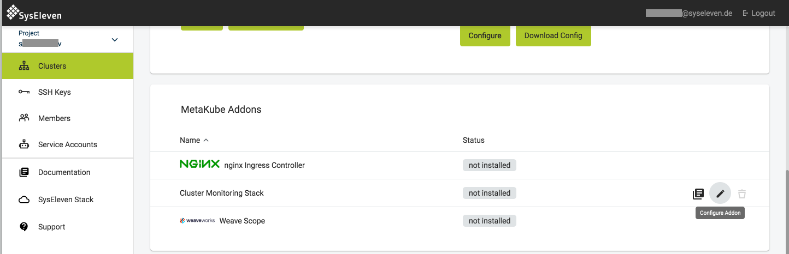

The monitoring add-on installs the following monitoring stack and enables users to monitor their metakube clusters and applications running on those clusters:

- [prometheus-operator](https://github.com/coreos/prometheus-operator)
- [prometheus](https://prometheus.io/)
- [alertmanager](https://prometheus.io/)
- [kube-state-metrics](https://github.com/helm/charts/tree/master/stable/kube-state-metrics)
- [grafana](https://github.com/helm/charts/tree/master/stable/grafana)

The addon can be installed by clicking on the edit button on the add-ons section and setting the desired configuration values:

