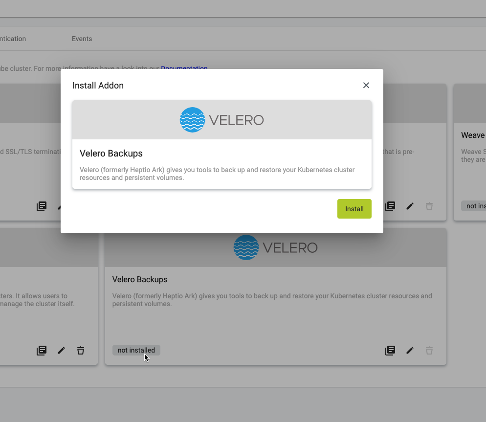

The Velero Backups addon installs [Velero](https://velero.io/), a fully functional Kubernetes backup solution that you can use to safely backup and restore Kubernetes cluster resources and persistent volumes.

The addon has no configuration parameters; you can just install it from the Metakube Dashboard with two clicks.

The Velero installation will be pre-configured to store the created backups in the object storage solution of the cloud provider your cluster is running on (Quobyte S3 on SysEleven Stack, Amazon S3 on AWS).

See the [Backup tutorial](../../03.Tutorials/18.create-backup-and-restore/default.en.md) for more information on using this addon.

-- OR move the tutorial here: ---

## Create a backup and restore from it

### Prerequisites

...
