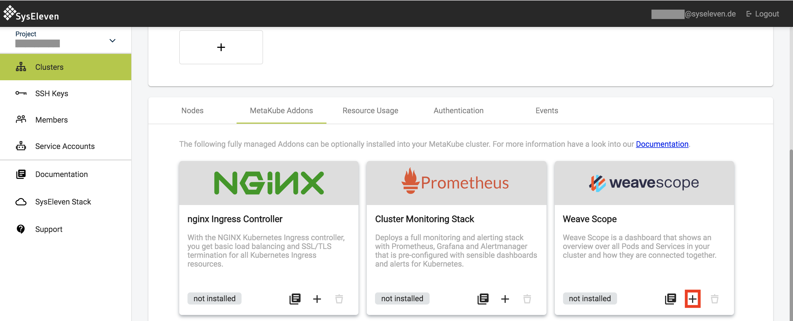
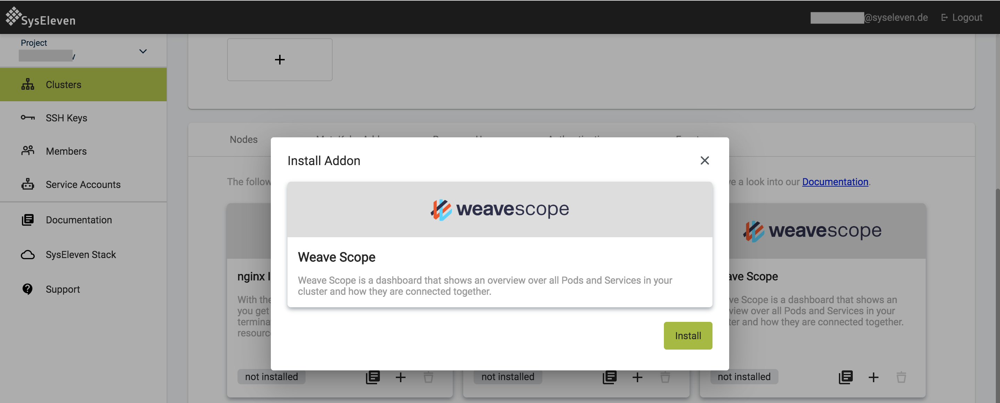

This addon installs [Weave Scope](https://www.weave.works/oss/scope/) by [weaveworks](https://www.weave.works/).

Weave Scope provides you a real time interactive view of all the hosts and the application(pods, services, processes etc) deployed in your kubernetes cluster. It also provides real time metrics, flexible filtering and search capabilities.

## Customization

Weave Scope addon requires zero configuration. Just install the addon by clicking on the '+' button.

Click on the weave scope icon in manged applications list to access the Weave Scope dashboard.
