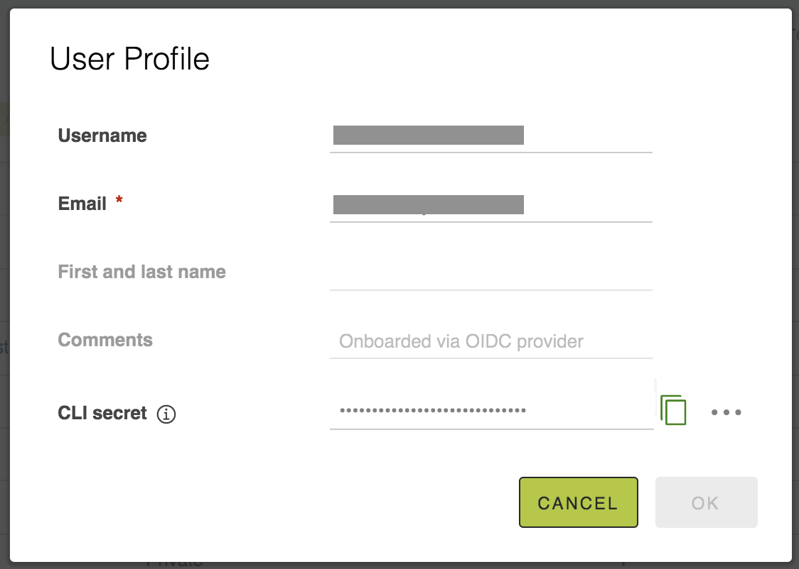

[SysEleven Container Registry (SCR)](https://scr.syseleven.de) is the managed registry for container images and Helm charts from [SysEleven](https://www.syseleven.de).

[SCR](https://scr.syseleven.de) is based on the [Cloud Native Comuputing Foundation](https://cncf.io) incubated, open source project [Harbor](https://goharbor.io/)

## Architectural Overview

The following document explains in detail the architechture of [Harbor](https://goharbor.io/)

## User Guide

SysEleven Container Registry follows the same user workflow as Harbor, following upstream tutorials can help SCR users
perform common tasks such as creating and managing new projects, adding repositories to projects, managing image label etc.

### Working with projects

This section describes how users with the developer, master, and project administrator roles manage and participate in SCR projects.

- [Creating new Projects](https://github.com/goharbor/harbor/blob/master/docs/1.10/working_with_projects/create_projects.md)
- [Configuring project properties](https://github.com/goharbor/harbor/blob/master/docs/1.10/working_with_projects/project_configuration.md)

### Working with images and tags

This section describes how to work with images and tags in SysEleven Container Registry.

- [Pushing and pulling images](https://github.com/goharbor/harbor/blob/master/docs/1.10/working_with_projects/pulling_pushing_images.md)
- [Managing image labels](https://github.com/goharbor/harbor/blob/master/docs/1.10/working_with_projects/create_labels.md)
- [Tagging images](https://github.com/goharbor/harbor/blob/master/docs/1.10/working_with_projects/retagging_images.md)
- [Working with tag retention rules](https://github.com/goharbor/harbor/blob/master/docs/1.10/working_with_projects/create_tag_retention_rules.md)
- [Working with tag immutability rules](https://github.com/goharbor/harbor/blob/master/docs/1.10/working_with_projects/create_tag_immutability_rules.md)

### Vulnerability Scanning

SCR provides static analysis of vulnerabilities in images through the open source [Clair](https://github.com/coreos/clair) project.

You can manually initiate scanning on a particular image, or on all images in SCR. Additionally, you can also set a policy to automatically scan all of the images at specific intervals.

- [Connect SCR to Additional Vulnerability Scanners](https://github.com/goharbor/harbor/blob/master/docs/1.10/administration/vulnerability-scanning/pluggable-scanners.md)
- [Scan Individual Images](https://github.com/goharbor/harbor/blob/master/docs/1.10/administration/vulnerability-scanning/scan-individual-image.md)
- [Scan All Images](https://github.com/goharbor/harbor/blob/master/docs/1.10/administration/vulnerability-scanning/scan-all-images.md)
- [Schedule Scans](https://github.com/goharbor/harbor/blob/master/docs/1.10/administration/vulnerability-scanning/schedule-scans.md)
- [Import Vulnerability Data to an Offline Harbor instance](https://github.com/goharbor/harbor/blob/master/docs/1.10/administration/vulnerability-scanning/import-vulnerability-data.md)
- [Configure System-Wide CVE Whitelists](https://github.com/goharbor/harbor/blob/master/docs/1.10/administration/vulnerability-scanning/configure-system-whitelist.md)

### Working with Helm charts

Helm is a package manager for kubernetes applications. SysEleven Container Registry comes with built in support for helm repositories.
The following tutorial will guide you on how to store and manager your helm charts with SCR.

- [Managing helm charts](https://github.com/goharbor/harbor/blob/master/docs/1.10/working_with_projects/managing_helm_charts.md)

### Login using Docker and Helm CLI

SCR provides a CLI secret for use when logging in from Docker or Helm. This is only available when SCR uses OIDC authentication.
For more infromation on how to setup OIDC authentications follow this [tutorial](https://github.com/goharbor/harbor/blob/master/docs/1.10/administration/configure_authentication/oidc_auth.md#configure-oidc-provider-authentication)

To login using Docker and Helm CLI follow the following steps:

1) Log in to Harbor with an OIDC user account.
2) Click your username at the top of the screen and select User Profile.

3) Click the clipboard icon to copy the CLI secret associated with your account.

4) Optionally click the ... icon in your user profile to display buttons for automatically generating or manually creating a new CLI secret.

5) If you generated a new CLI secret, click the clipboard icon to copy it.
You can now use your CLI secret as the password when logging in to Harbor from the Docker or Helm CLI.

For example to login using docker CLI use the following command.

`docker login -u <username> -p <cli_secret> scr.syseleven.de`

### Working with Robot Accounts

SCR allows users to create robot accounts in each project, to use for automated operation. To create and use robot accounts follow this [tutorial](https://github.com/goharbor/harbor/blob/master/docs/1.10/working_with_projects/create_robot_accounts.md).

### Working with Webhooks

SCR project administrator can configure webhook endpoint inside a project, which can be triggered based on certain events. This [tutorial](https://github.com/goharbor/harbor/blob/master/docs/1.10/working_with_projects/configure_webhooks.md#configure-webhook-notifications) will guide you on how
 to use webhooks with SCR.
